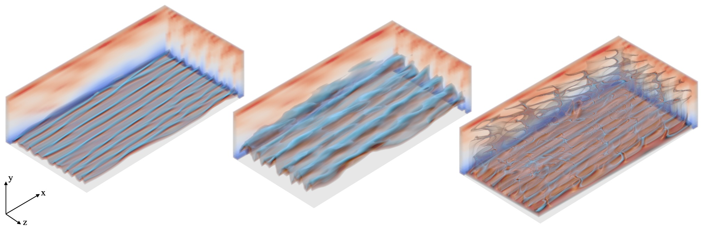

#  INC: Implicit Neural Correction for PDE Solvers


[](https://opensource.org/licenses/Apache-2.0)
[](https://www.python.org/downloads/release/python-380/)
[](https://pytorch.org/)
[](https://developer.nvidia.com/cuda-toolkit)

## Overview

<p align="center">
  
</p>

**INC** (Implicit Neural Correction) is a novel hybrid framework that combines classical numerical PDE solvers with neural network-based correction terms to achieve accurate, stable, and efficient simulations of complex dynamical systems. This repository contains the official implementation of the research paper on implicit neural corrections for time-stepping PDE solvers.

The key innovation is the **implicit correction mechanism**: instead of predicting the solution directly, neural networks predict correction terms that are seamlessly integrated into classical numerical solvers (e.g., finite difference (WENO schemes), pseudo-spectral method, and PISO algorithm). This hybrid approach achieves:

- **Superior long-term stability** compared to purely data-driven methods
- **Computational efficiency** by enabling coarser spatial and temporal resolutions
- **Seamless integration** with existing numerical solvers
- **Physics-guaranteed learning** through coupling with solver dynamics


## Key Features

- **Hybrid Solver Architecture**: Combines classical numerical methods with neural network corrections
- **Multiple Neural Network Backends**: Support for FNO (Fourier Neural Operator), U-Net, DeepONet, ResNet, and custom CNN architectures (for PISO solver)
- **Efficient Multi-Resolution Training**: Large time-stepping and coarse-grid training with fine-grid accuracy
- **GPU-Accelerated CUDA Extensions**: Custom CUDA kernels for PISO solver and multi-block domain handling with refinement on complex geometries
- **Comprehensive Training Pipeline**: Includes data generation, training, evaluation, and visualization tools
- **Modular Design**: Easy to extend to new PDEs and solver types

## Methodology: From Theory to Practice

### Core Concept: Implicit Neural Correction

Classical PDE solvers discretize equations in space and time. However, discretization introduces errors, especially on coarse grids. The INC framework addresses this by learning **correction terms** $s(\mathbf{u})$ that are implicitly integrated into the time-stepping scheme:

$$
\mathbf{u}^{n+1} = \mathcal{S}(\mathbf{u}^n, s(\mathbf{u}^n), \Delta t)
$$

where:
- $\mathbf{u}^n$ is the solution at time step $n$
- $\mathcal{S}$ is the classical numerical solver operator
- $s(\mathbf{u}^n)$ is the neural network correction term
- $\Delta t$ is the time step

### Implementation Architecture

The methodology is implemented across several key components:

#### 1. **Numerical Solvers** (`solvers/`)

**For 1D problems** (`solver_1d.py`):
- `BurgersSolverTorch`: Implements Burgers' equation with WENO or finite difference schemes
- `KSSolverTorch`: Kuramoto-Sivashinsky equation solver with spectral methods
- The correction term $s(\mathbf{u})$ is integrated as a source term in the PDE

**For 2D/3D problems** (`solver_2d.py`):
- `PISOtorch_diff`: Differentiable PISO (Pressure-Implicit with Splitting of Operators) solver
- Custom CUDA kernels in `extensions/` for efficient multi-block computations
- Correction implemented via velocity source terms
- Support for 3D problems with providing the domain in 3D

#### 2. **Neural Network Models** (`models/`)

Multiple architectures are supported, implemented in `models/`.

>**Note:** For 2D problems (`models/models_2d.py`):
>- `CorrectorINC`: Manages correction term generation and integration with PISO solver
>- `SmallCNNModel`: Multi-block CNN for applying corrections with correct block handling

#### 3. **Training Framework** (`trainer/`)

The training process is implemented in `trainer/trainer_1d.py` and `trainer/trainer_2d.py`.

#### 4. **Data Pipeline** (`data/`)

Detailed in the following section.

#### 5. **Configuration Management** (`config/`)

The configuration files (`config/config_1d.py`, `config/config_2d.py`) define:

1. **Simulation parameters**: Grid resolution, time steps, physical parameters (viscosity, Reynolds number)
2. **Model parameters**: Architecture choice, hidden dimensions, number of layers
3. **Training parameters**: Learning rate, weight decay, regularization strengths
4. **Multi-step training**: Progressive training with increasing prediction horizons

## Installation

### Prerequisites

- **Operating System**: Linux (tested on Ubuntu 18.04+)
- **Python**: 3.8.0
- **CUDA**: 11.7 or compatible (for PISO solver)
- **Conda**: For environment management
- **GCC/G++**: Version 6.0-11.5 (for CUDA extension compilation)

### Setup Steps

1. **Clone the repository**
   ```bash
   git clone https://github.com/tum-pbs/INC.git
   cd INC
   ```

2. **Create and activate the conda environment**
   ```bash
   # Create environment from the provided specification
   conda create --name inc --file environment.txt
   
   # Activate the environment
   conda activate inc
   ```

3. **Install CUDA extensions** (Optional, required for 2D PISO solver)
   
   The CUDA extensions provide optimized implementations of the PISO solver for 2D problems:
   ```bash
   cd extensions
   python setup.py install
   cd ..
   ```
   
   **Note**: If you only plan to work with 1D problems (Burgers, KS equations), you can skip this step.

4. **Verify installation**
   ```bash
   python -c "import torch; print(f'PyTorch: {torch.__version__}'); print(f'CUDA available: {torch.cuda.is_available()}')"
   python -c "import torch; import PISOtorch; print('PISOtorch imported successfully')"
   ```
   **Note**: Always import torch before import PISOtorch.

**Note**: If you encounter issues with CUDA extension compilation, ensure that your CUDA toolkit and GCC versions are compatible. The version of CUDA matters for PISO solver a lot since the linear solver relies on specific CUDA functionalities, which changed quite a bit across versions. 

## Getting Started

### Data Preparation

Before training, you need to download the dataset from Hugging Face:

```bash
# Install huggingface_hub if not already installed
pip install huggingface_hub

# Download the dataset
huggingface-cli download thuerey-group/INC_Data --repo-type dataset --local-dir INC_Data
```

Alternatively, you can use Python:
```python
from huggingface_hub import snapshot_download

snapshot_download(
    repo_id="thuerey-group/INC_Data",
    repo_type="dataset",
    local_dir="./INC_Data"
)
```

The dataset will be downloaded to `INC_Data/` with the following structure:
- `INC_Data/KS/Dataset/` - Kuramoto-Sivashinsky equation simulation data
- `INC_Data/BFS/Dataset/` - Backward-Facing Step flow simulation data

Each dataset contains train/valid/test splits for model training and evaluation.


### Loading the Dataset

```python
from huggingface_hub import snapshot_download

# Download entire dataset
snapshot_download(
    repo_id="thuerey-group/INC_Data",
    repo_type="dataset",
    local_dir="./INC_Data"
)
```

### Using the Kuramoto-Sivashinsky (KS) Dataset

#### Loading KS Data

```python
import torch
from torch.utils.data import DataLoader
from data.data_loader_1d import KSDataset, KS_collate_fn

# Load pre-generated KS dataset
data = torch.load("INC_Data/KS/Dataset/Res64_Batch30_T100.0_Dt0.01_train.pth")

# Create dataset with mstep=8 (predict 8 steps forward)
dataset = KSDataset(data, dt=0.01, mstep=8)

# Create DataLoader
dataloader = DataLoader(
    dataset, 
    batch_size=32, 
    shuffle=True, 
    collate_fn=KS_collate_fn
)

# Iterate through batches
for batch in dataloader:
    u_initial = batch["u_initial"]      # [batch_size, spatial_points]
    u_target = batch["u_target"]        # [batch_size, mstep, spatial_points]
    domain_size = batch["domain_size"]  # [batch_size, 1]
    print(f"Initial state shape: {u_initial.shape}")
    print(f"Target trajectory shape: {u_target.shape}")
    break
```

#### KS Quick Visualization

```python
import torch
import matplotlib.pyplot as plt

# Load KS data
data = torch.load("INC_Data/KS/Dataset/Res64_Batch30_T100.0_Dt0.01_train.pth")

# Get the first trajectory
trajectory = data["trajectories"][0]  # shape: [T+1, spatial_points]

# Visualize
plt.figure(figsize=(12, 4))
plt.imshow(trajectory.T.numpy(), aspect='auto', cmap='RdBu')
plt.xlabel('Time Step')
plt.ylabel('Spatial Position')
plt.colorbar(label='Solution Value')
plt.title('Kuramoto-Sivashinsky Dynamics')
plt.tight_layout()
plt.show()

# Print metadata
print(f"Temporal resolution (dt): {data['metadata']['gen_dt']}")
print(f"Total trajectories: {len(data['trajectories'])}")
print(f"Spatial resolution: {data['trajectories'].shape[-1]} points")
print(f"Temporal steps: {data['trajectories'].shape[1]} steps")
```

### Using the Backward-Facing Step (BFS) Dataset

#### Loading BFS Data

Loading the BFS dataset can refer to `data_loader_2d`, but all data is managed with custom domain objects. Here is an example of loading the BFS dataset.

```python
import torch
from torch.utils.data import DataLoader
from data.data_loader_2d import load_data

# Load BFS dataset for training with time range filter
dataloader, stats = load_data(
    split="train",
    dtype=torch.float32,
    task="BFS",
    run_dir="./output",
    time_range=(0, 1000),      # Optional: filter by timestamp range
    downsample_factor=4,        # Spatial downsampling
    mstep=8,                    # Predict 8 steps forward
    shuffle=True,
    data_norm=True,             # Compute and save dataset statistics
    num_batches=None            # Use all batches (set to N to limit)
)

# Iterate through batches
for batch in dataloader:
    config_keys = batch['config_keys']  # Geometry configurations
    x_batch = batch['x']                # Current state (list of domain objects)
    y_batch = batch['y']                # Target trajectories (list of lists)
    time_stamps = batch['time_stamps']  # Temporal information
    
    print(f"Configuration: {config_keys[0]}")
    print(f"Current domain fields: u, v, p (velocity and pressure)")
    break

# Access computed statistics for normalization
print("Dataset Statistics:")
for key, value in stats.items():
    print(f"  {key}: {value}")
```

#### Accessing Domain Fields

```python
import torch
from torch.utils.data import DataLoader
from data.data_loader_2d import load_data

# Load BFS data
dataloader, _ = load_data(
    split="train",
    dtype=torch.float32,
    task="BFS",
    run_dir="./output",
    downsample_factor=4,
    mstep=1
)

# Get a sample
for batch in dataloader:
    domain = batch['x'][0]  # First sample's domain
    
    # Access velocity fields
    blocks = domain.getBlocks()
    for block in blocks:
        velocity = block.velocity     # Shape: [1, 2, height, width] for 2D
        pressure = block.pressure     # Shape: [1, 1, height, width]
        
        print(f"Block name: {block.name}")
        print(f"Velocity shape: {velocity.shape}")
        print(f"Pressure shape: {pressure.shape}")
    break
```


### Training

#### Training 1D Models (KS)

Use the provided training scripts with various model architectures:

**Example: Train U-Net on Kuramoto-Sivashinsky**
```bash
python scripts/Train_1D.py \
  --mode train \
  --task KS \
  --model_type UNet \
  --correction_term INC \
  --down_ratio 8 \
  --mstep 50 \
```

**Using shell scripts** (recommended for batch training):
```bash
# Train on KS equation
./scripts/train_KS.sh train 1 0  # model_type_idx=1 (UNet), GPU 0
```

**Note**: You can also just call ./scripts/train_KS.sh to see the supported options

**Available model types**:
`FNO`, `UNet`, `DeepONet`, `ResNet`

**Key training arguments**:
- `--task`: Choose `KS` for Kuramoto-Sivashinsky equation
- `--correction_term`: Use `INC` for implicit neural correction
- `--down_ratio`: Downsampling factor, fixed at 8 for KS
- `--mstep`: Number of time steps to predict during training
- `--test_steps`: Number of evaluation steps

#### Training 2D Models (BFS)

```bash
python scripts/Train_BFS.py \
  --mode train \
  --method INC \
  --model_type SmallCNN \
  --substeps ADAPTIVE
```

Or use the shell script:
```bash
./scripts/train_BFS.sh train 0  # GPU 0
```

### Inference & Evaluation

#### Evaluate Trained Models

**For 1D problems**:
```bash
# Test with specific model
python scripts/Train_1D.py \
  --mode test \
  --task KS \
  --model_type FNO \
  --correction_term INC \
  --down_ratio 8 \
  --model_id 251016-174722 \
  --test_steps 5000
```

**For 2D problems**:
```bash
python scripts/Train_BFS.py \
  --mode test \
  --model_id 250316-165159 \
```

#### Visualization & Analysis

Generate plots and analysis:

**KS equation results**:
```bash
python analysis/Plot_KS.py --model_id 251016-174722
```

**BFS flow results**:
```bash
python analysis/Plot_BFS.py --model_id 250316-165159
```

### Directory Structure After Training

```
INC_Data/
├── KS/
│   ├── Dataset/
│   └── Results/              # Trained model checkpoints
│       └── UNet_Corr-INC/
│           └── Res_64/
│               └── {timestamp}_mstep50_dt0.01.../
└── BFS/
    ├── Dataset/
    └── Results/
        └── NoModel/        # Baseline without correction
        └── INC_SmallCNN/
            └── {timestamp}_mstep8_.../ # an example model
```

## Code Structure

```
.
├── config/                   # Configuration files for different PDEs
│   ├── config_1d.py          # Parameters for KS equations
│   └── config_2d.py          # Parameters for BFS flow
├── data/                     # Data loading and domain management
│   ├── data_loader_1d.py     # Dataset classes for 1D problems
│   ├── data_loader_2d.py     # Dataset classes for 2D problems
│   └── DomainManager.py      # Multi-block domain handling
├── models/                   # Neural network architectures
│   ├── models_1d/            # 1D model implementations
│   │   ├── fno.py            # Fourier Neural Operator
│   │   ├── unet.py           # U-Net
│   │   ├── deeponet.py       # DeepONet
│   │   └── resnet.py         # ResNet 
│   └── models_2d.py          # 2D corrector models for PISO
├── solvers/                  # Numerical PDE solvers
│   ├── solver_1d.py          # Burgers and KS solvers
│   └── solver_2d.py          # PISO solver wrapper, 2D implemented, supports 3D
├── trainer/                  # Training and evaluation logic
│   ├── trainer_1d.py         # Training pipeline for 1D problems
│   └── trainer_2d.py         # Training pipeline for 2D problems
├── scripts/                  # Executable scripts
│   ├── Train_1D.py           # Main training script for 1D
│   ├── Train_BFS.py          # Main training script for BFS
│   ├── Sim_BFS.py            # BFS data generation
│   └── *.sh                  # Batch training shell scripts
├── analysis/                 # Visualization and analysis tools
│   ├── Plot_KS.py            # Plot KS equation results
│   └── Plot_BFS.py           # Plot BFS flow fields
├── extensions/               # CUDA extensions for 2D solver
│   ├── PISO_multiblock_cuda_kernel.cu
│   ├── bicgstab_solver_kernel.cu
│   └── setup.py              # Extension compilation script
├── lib/                      # Utility functions
│   ├── modules/              # Custom PyTorch modules
│   ├── data/                 # Data handling utilities
│   └── util/                 # Logging, plotting, GPU management
├── environment.txt           # Conda environment specification
├── LICENSE                   # Apache 2.0 License
└── README.md                 # This file
```


## Citation

If you use this code in your research, please cite our paper:

```bibtex
@article{INC2025,
  title={{INC}: An Indirect Neural Corrector for Auto-Regressive Hybrid {PDE} Solvers},
  author={Hao Wei, Aleksandra Franz, Björn Malte List, Nils Thuerey},
  booktitle={The Thirty-ninth Annual Conference on Neural Information Processing Systems},
  year={2025},
}
```

## Acknowledgments

This work builds upon:
- **PICT solver** (Franz et al., 2025)
- **Solver-in-the-Loop** (Um et al., 2020)
- **Fourier Neural Operator** (Li et al., 2020)
- **DeepONet** (Lu et al., 2021)
- **PISO Algorithm** (Issa, 1986)
- **WENO Schemes** (Jiang & Shu, 1996)